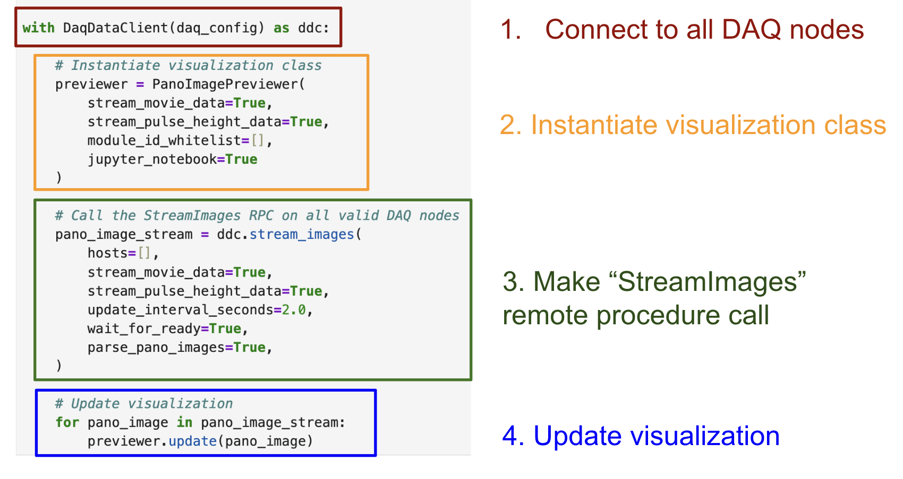

# panoseti_grpc
Contains gRPC code for the PANOSETI project. See [here](https://github.com/panoseti/panoseti) for the main software repo.

## Environment Setup for gRPC Clients and Servers

Follow the steps below to prepare your environment to run gRPC code:

1. Install `miniconda` ([link](https://www.anaconda.com/docs/getting-started/miniconda/install))
2. Clone this (`panoseti_grpc`) repo onto a DAQ node or any client computer.
3. Run the following commands to create the `grpc-py39` environment. 
```bash
git clone https://github.com/panoseti/panoseti_grpc.git
cd panoseti_grpc
conda create -n grpc-py39 python=3.9
conda activate grpc-py39
conda install -c conda-forge grpcio-tools
pip install -r requirements.txt
```

# DaqData Service


## Core RPCs
### `StreamImages`


- The gRPC server's `hp_io` thread compares consecutive snapshots of the current run directory to identify the last image frame for each Hashpipe data product, including `ph256`, `ph1024`, `img8`, `img16`. These image frames are subsequently broadcast to ready `StreamImages` clients.
- A given image frame of type `dp` from module `N` will be sent to a client when the following conditions are satisfied:
    1. The time since the last server response to this client is at least as long as the client’s requested `update_interval_seconds`.
    2. The client has requested data of type `dp`.
    3. Module `N` is on the client’s whitelist.
- $N \geq 0$ `StreamImages` clients may be concurrently connected to the server.

### `InitHpIo`

- Enables reconfiguration of the `hp_io` thread during an observing run.
- Requires an observing run to be active to succeed.
- $N \leq 1$ `InitHpIo` clients may be active at any given time. If an `InitHpIo` client is active, no other client may be.


## Working with the gRPC DaqData API

### Using the Client CLI

```
daq_data/client_cli.py  - demonstrates real-time pulse-height and movie-mode visualizations using the DaqData API.

usage: client_cli.py [-h] [--host HOST] [--ping] [--list-hosts] [--reflect-services] [--init CFG_PATH] [--init-sim] [--plot-view] [--plot-phdist] [--module-ids [MODULE_IDS ...]]
                     [--log-level {debug,info,warning,error,critical}]
                     daq_config_path

positional arguments:
  daq_config_path       path to daq_config.json file for the current observing run

optional arguments:
  -h, --help            show this help message and exit
  --host HOST           DaqData server hostname or IP address.
  --ping                ping the specified host
  --list-hosts          list available DAQ node hosts
  --reflect-services    list available gRPC services on the DAQ node
  --init CFG_PATH       initialize the hp_io thread with CFG_PATH='/path/to/hp_io_config.json'
  --init-sim            initialize the hp_io thread to track a simulated run directory
  --plot-view           whether to create a live data previewer
  --plot-phdist         whether to create a live pulse-height distribution for the specified module id
  --module-ids [MODULE_IDS ...]
                        whitelist for the module ids to stream data from. If empty, data from all available modules are returned.
  --log-level {debug,info,warning,error,critical}
                        set the log level for the DaqDataClient logger. Default: 'info'
```

Below is an example workflow for using `daq_data/client_cli.py` to view real-time data from a real or simulated observing run directory.

#### On the Headnode
1. Start an observing session ([docs](https://github.com/panoseti/panoseti/wiki/sessions-and-configuration)).
2. Run `start.py` in the `panoseti/control` directory to start an observing run.

#### On each DAQ Node in `/path/to/daq_config.json`
1. Set up the `grpc-py39` environment as described above.
2. Set the working directory to `panoseti_grpc/`.
3. Run `python -m daq_data.daq_data_server`.

#### On Any Computer 
1. Set up the `grpc-py39` environment as described above.
2. Update `hp_io_config.json` or create a new one (see docs below).
3. Set the working directory to `panoseti_grpc/`.
4. (optional) Run `export DAQ_CFG=/path/to/daq_config.json` to create a convenient variable for `/path/to/daq_config.json`. If you don't want to do this, replace `$DAQ_CFG` in all following commands with `/path/to/daq_config.json`.
5. Run `python -m daq_data.client_cli -h` to see the available options.
6. Run `python -m daq_data.client_cli $DAQ_CFG --list-hosts` to find DAQ node hosts running valid DaqData gRPC servers. The hostname `H` in the following commands should be in the list of valid hosts returned by this command.
7. Initialize the `hp_io` thread on the DaqData server on DAQ node `H`:
   - (Real data) Run `python -m daq_data.client_cli $DAQ_CFG --init /path/to/hp_io_config.json` to initialize with`hp_io_config.json`.
   - (Simulated data) Run `python -m daq_data.client_cli $DAQ_CFG --init-sim` to initialize with `daq_data/config/hp_io_config_simulate.json`. This starts a stream of simulated data.
8. Start visualization apps:
   - Run `python -m daq_data.client_cli $DAQ_CFG --plot-phdist` to make a  request and launch a real-time pulse-height distribution visualization app.
   - Run `python -m daq_data.client_cli $DAQ_CFG --plot-view` to make a `StreamImages` request and launch a real-time pulse-height and movie-mode visualization app.

Notes: 
- On Linux, the `Ctrl+P` keyboard shortcut loads commands from your command history. Useful for running the `python -m daq_data.client_cli` module with different options.
- `panoseti_grpc` has a package structure, so your working directory should be the repo root, `panoseti_grpc/`, when running modules in `panoseti_grpc/daq_data/`.
- Each script (e.g. `daq_data_server.py`) should be prefixed with **`python -m daq_data.`** and, because it is a module, be called without the `.py` extension. Following these guidelines gives the example command for step 4: **`python -m daq_data.daq_data_server`**, instead of `./daq_data_server.py` or  `python -m daq_data.daq_data_server.py`.

### The hp_io_config.json file

`hp_io_config.json` is used to configure `InitHpIo` RPCs to initialize the gRPC server's `hp_io` thread.

```json
{
  "data_dir": "/mnt/panoseti",
  "update_interval_seconds": 0.1,
  "force": true,
  "simulate_daq": false,
  "module_ids": [],
  "comments": "Configures the hp_io thread to track observing runs stored under /mnt/panoseti"
}
```

- `data_dir`: the data acquisition directory a Hashpipe instance is writing to. Contains `module_X/` directories.
- `update_interval_seconds`: the period, in seconds, between consecutive snapshots of the run directory. Must be greater than the minimum period specified by the `min_hp_io_update_interval_seconds` field in daq_data/config/daq_data_server_config.json.
- `force`: whether to force a configuration of `hp_io`, even if other clients are currently active.
    - If `true`, the server will stop all active `StreamImages` RPCs then re-configure the `hp_io` thread using the given configuration. During initialization, new `StreamImages` and `InitHpIo` clients may join a waiting queue, but will not be handled until after the configuration has finished (regardless of success or failure). Use this option to guarantee your `InitHpIo` request is handled.
    - If `false`, the `InitHpIo` request will only succeed if no other `StreamImages` RPCs are active. If any `StreamImages` RPCs are active, this `InitHpIo` RPC will immediately return with information about the number of active`StreamImages`. Use this option if other users may be using the server.
- `simulate_daq`: overrides `data_dir` and causes the server to stream data from archived observing data. Use this option for debugging and developing visualizations without access to observatory hardware.
- `module_ids`: whitelist of module data sources.
    - If empty, the server will broadcast data snapshots from all active modules (detected automatically).
    - If non-empty, the server will only broadcast data from the specified modules.

## Developing Real-Time Visualizations with the DaqData API


[todo: expand]

1. Define a visualization class.
2. Implement a method that updates a visualization given a new panoseti image.
3. Follow the following code pattern:


# UbloxControl Service (TODO)
...
