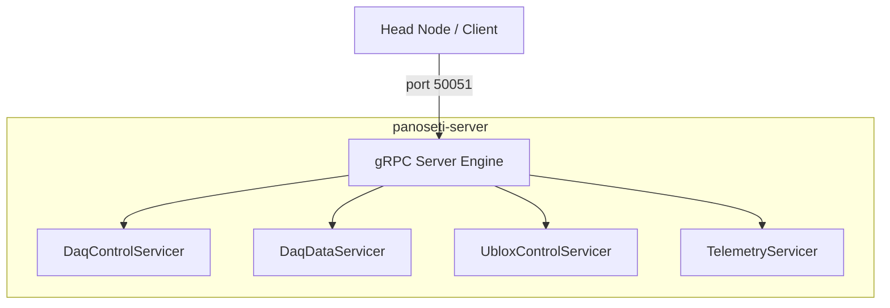

# PSETI Unified gRPC Server

The PSETI Unified Server (`panoseti-server`) is the primary service entry point for all PANOSETI gRPC services. It co-hosts multiple functional modules on a single TCP port, providing a unified interface for observatory control, data acquisition, and telemetry.

---

## Architecture

The server follows a **Composite Servicer** pattern. Each functional domain (DaqControl, DaqData, Telemetry, etc.) is implemented as an independent class and registered with the unified gRPC server instance.



---

## Supported Services

| Service | Protos | Description |
|---|---|---|
| **DaqControl** | `daq_control.proto` | Process lifecycle (Hashpipe), manifest generation, and disk cleanup. |
| **DaqData** | `daq_data.proto` | Real-time science data streaming (Movie & PH) from Hashpipe shared memory. |
| **UbloxControl** | `ublox_control.proto` | GNSS/Timing synchronization (White Rabbit/U-blox TIM-TP). |
| **Telemetry** | `telemetry.proto` | Centralized log aggregation and system health monitoring (Loki sink). |

---

## Deployment Profiles

The server behavior is driven by **Profiles**, which determine which services are active. Profiles are defined in `src/panoseti_grpc/config/server_profiles.toml`.

### `daq_node` (Default)
Activates services required on physical DAQ nodes:
- `DaqControl`: Enabled
- `DaqData`: Enabled
- `UbloxControl`: Enabled
- `Telemetry`: Enabled (Log Forwarder)

### `telemetry_hub`
Activates centralized telemetry aggregation (typically runs only on the Head Node):
- `DaqControl`: Disabled
- `DaqData`: Disabled
- `Telemetry`: Enabled (Aggregator Sink)

---

## Usage

### Command Line Interface

```bash
# Start the default profile (daq_node)
panoseti-server --profile daq_node

# Override the listening port
GRPC_PORT=50052 panoseti-server --profile daq_node

# Run in debug mode (verbose logging)
panoseti-server --profile daq_node --level DEBUG
```

### Docker (Recommended)

```bash
docker compose up -d panoseti-server
```

---

## Engineering Standards

### 1. Unified Logging
All services MUST use the `panoseti_grpc.telemetry.logger.get_logger()` factory. This ensures that logs are:
1. Emitted to stdout (Rich).
2. Saved to local `/var/log/panoseti/*.log`.
3. Forwarded to the centralized Telemetry/Loki stack if enabled.

### 2. Async-First
The server is built on `grpc.aio` and `asyncio`. All servicer methods MUST be `async def`. Blocking I/O (like heavy filesystem walks) MUST be offloaded using `asyncio.to_thread`.

### 3. Error Handling
All RPC handlers should be decorated with `@grpc_error_handler` from `panoseti_grpc.util.error_handling`. This decorator catches unexpected exceptions and returns a consistent `grpc.StatusCode.INTERNAL` response while ensuring `asyncio.CancelledError` propagates correctly.

---

## Testing

Integration tests for the unified server live in the `tests/` directory of the `grpc` repository.

```bash
# Run all server integration tests
pseti test grpc all
```
