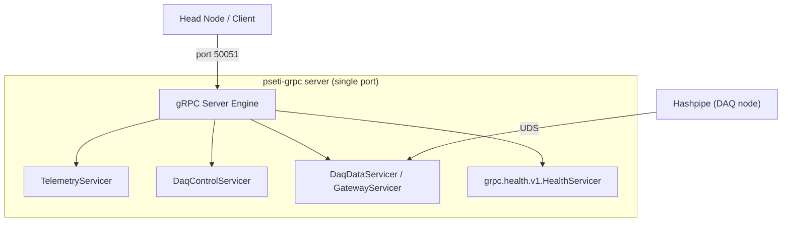

# PSETI Unified gRPC Server

The unified server (`pseti-grpc server`) co-hosts all active PANOSETI gRPC services on a single TCP port. gRPC routes RPCs by proto package name automatically — no collision between services.

---

## Architecture



---

## Active Services

| Service | Proto package | Status | Purpose |
|---|---|---|---|
| **DaqControl** | `daqcontrol.DaqControl` | Production | Hashpipe lifecycle, manifests, selective cleanup |
| **DaqData** | `daqdata.DaqData` | Production | Real-time science image streaming from Hashpipe UDS |
| **Telemetry** | `telemetry.Telemetry` | Beta | Device status → Redis/InfluxDB; log shipping via Grafana Alloy → Loki |
| **U-blox Control** | `ublox_control.UbloxControl` | 🔴 Deprecated | Disabled by default; migrate to `Telemetry.ReportStatus` with `GnssPayload` |

---

## Deployment Profiles

Profiles are defined in `src/panoseti_grpc/config/`. Choose based on machine role.

| Profile flag | Config file | Services | Machine |
|---|---|---|---|
| _(default)_ | `server.toml` | telemetry + daq_data + daq_control | Single-machine dev/test |
| `--profile daq_node` | `server_daq_node.toml` | daq_data + daq_control | Each DAQ compute node |
| `--profile headnode` | `server_headnode.toml` | telemetry | Observatory head node |

On DAQ nodes (`telemetry = false`), services that set `grpc_logging = true` forward logs to the headnode telemetry endpoint at `HEADNODE_IP:HEADNODE_GRPC_PORT` automatically.

---

## Usage

### Command Line

```bash
# All services (default config)
pseti-grpc server

# DAQ node: daq_data + daq_control
pseti-grpc server --profile daq_node

# Head node: telemetry only
pseti-grpc server --profile headnode

# Custom config file
pseti-grpc server --config /etc/panoseti/server.toml

# Print registered services and exit (no server started)
pseti-grpc server --list-services

# Debug log level
pseti-grpc server --profile daq_node --level DEBUG
```

Equivalent entrypoint:
```bash
python -m panoseti_grpc
```

### Config File Structure

```toml
[server]
port = 50051
shutdown_grace_period = 5.0
log_dir = "/var/log/panoseti"
grpc_logging = true

[server.services]
telemetry   = true
daq_data    = true
daq_control = true

[telemetry]
redis_host = "localhost"
redis_port = 6379

[daq_data]
# DaqDataServerConfig fields — see docs/daq_data_service.md

[daq_control]
log_dir = "/var/log/panoseti"
```

---

## Health Checks (`grpc.health.v1`)

After all services start, the server auto-registers `grpc.health.v1.HealthServicer` and marks every active service `SERVING`.

Check with `grpc_health_probe`:
```bash
grpc_health_probe -addr=daqnode-1:50051 -service=daqdata.DaqData
grpc_health_probe -addr=daqnode-1:50051 -service=daqcontrol.DaqControl
grpc_health_probe -addr=headnode:50051  -service=telemetry.Telemetry
```

Or via the Python `HealthClient`:
```python
from panoseti_grpc.grpc_utils.health import HealthClient
async with HealthClient("daqnode-1", 50051) as hc:
    ok = await hc.check("daqdata.DaqData")
```

The `daq_data.Ping` RPC is deprecated — use the health check endpoint instead.

---

## DAQ Node Status Command

`pseti-grpc daqnode` reports gRPC service health, Grafana Alloy liveness, and log-disk usage for a running DAQ node (or the head node):

```bash
# Human-readable table
pseti-grpc daqnode --log-dir /var/log/panoseti

# JSON output (for scripting)
pseti-grpc --json daqnode --log-dir /var/log/panoseti

# Skip Alloy check (when Alloy is not deployed)
pseti-grpc daqnode --skip-alloy --log-dir /var/log/panoseti

# Connect to a remote node
pseti-grpc --host daqnode-1 --port 50051 daqnode --log-dir /data/panoseti/logs
```

Output includes:
- Per-service gRPC health status (`SERVING` / `NOT_SERVING` / `UNKNOWN`)
- Alloy `/-/ready` endpoint health
- Log directory disk usage

---

## Initialization Order

Services start in this order: `telemetry → daq_data → daq_control`

Telemetry is live before other servicers initialize, so `get_logger(..., grpc_enabled=True)` calls from daq_data and daq_control can connect to the local telemetry endpoint immediately.

---

## Adding a New Service (5-step checklist)

1. Implement the servicer and proto; run `python scripts/compile_protos.py`
2. Write `async def _make_<name>_servicer(cfg, shutdown_event) -> (servicer, [post_start_coros])` in `server.py`
3. Add `<name>: NewServiceConfig = Field(default_factory=NewServiceConfig)` to `PanosetiServerConfig`
4. Add `<name>: bool = False` to `ServiceToggles`
5. Call `ServiceRegistry.register(ServiceDescriptor("<name>", ...))` at module level in `server.py`
6. Add a `[<name>]` section to relevant `server*.toml` profile files

No changes to `PanosetiServer` itself are needed.

---

## Engineering Standards

### Unified Logging

All services MUST use `panoseti_grpc.telemetry.logger.get_logger()`, which writes to four destinations simultaneously:

1. Console (Rich)
2. `{service}.log` — plain text, rotating, under `{log_dir}/{hostname}/`
3. `{service}.jsonl` — structured JSON for Grafana Alloy → Loki
4. gRPC `Log` RPC (shadow period — running in parallel during migration)

### Async-First

All servicer methods MUST be `async def`. Blocking I/O MUST be offloaded via `asyncio.to_thread`.

### Error Handling

All RPC handlers MUST be decorated with `@grpc_error_handler` from `panoseti_grpc.util.error_handling`. This catches unhandled exceptions and returns a consistent `INTERNAL` status while propagating `CancelledError` correctly.

---

## Testing

```bash
# Unit tests (no Docker required)
pytest tests/unified_server/unit/ -v

# Integration tests (requires Docker/Redis)
pytest tests/unified_server/integration/ -v --timeout=90

# Via unified QA runner
python tests/qa.py all
pseti test grpc all
```
