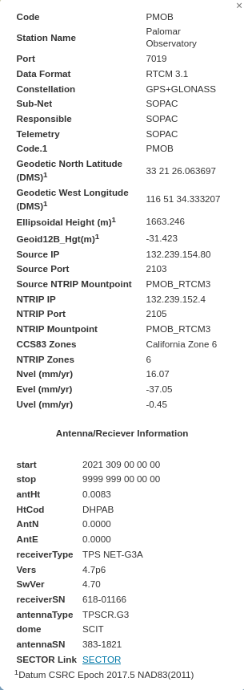
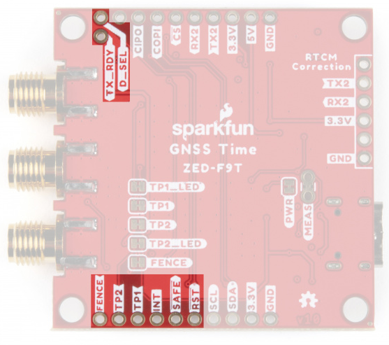
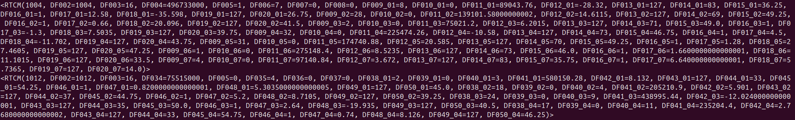

Overview
============

Sometimes it is easier to configure a single device without having to instantiate the entire machinery of grpc. The files here are meant to facilitate that for either an F9T or an F9P. In principle, because the F9P is only used during commissioning of a new telescope, this also serves as the defacto script for configuring an F9P. The goal of this *README* is to show how to use the code as well as describe what is in there. 

Configuring an F9T
------------
There are two different configuration files for the F9T: `f9t_config_base_example.json5` and `f9t_config_base_receiver.json5`. The big difference between these two is that the base is responsible for sending out correction data to the receiver in order to improve differential timing. The interface description for the F9T is  is from Sparkfun: [Zed F9T Interface Description direct link](https://cdn.sparkfun.com/assets/8/4/d/1/6/ZED-F9T-00B_IntegrationManual.pdf. This works as of September 2025. The timing system that are enabled are GPS L1/2, Galileo E1/5B, and Beidou (B1/2) are enabled. Suggested registers for a base station are given in Section 3.1.5.5 of the [Zed F9T Integration Manual](https://cdn.sparkfun.com/assets/8/4/d/1/6/https://content.u-blox.com/sites/default/files/ZED-F9T_IntegrationManual_UBX-21040375.pdf).

To configure the F9T with the base configuration run the following from the command line:
```console
foo@bar:~$ ./conf_gnss_no_grpc.py ../../config/f9t_config_base_example.json5
```

Note: Be careful that you have the right USB port (e.g. /dev/ttyACM0). Also, the given position will likely need to be updated depending on what you get from the F9P. See the section on configuring an F9P for how to do this.


Configuring an F9P
------------
Configuring an F9P can be done in the exact same way as configuring an F9T. From the command line run

```console
foo@bar:~$ ./conf_gnss_no_grpc.py ../../config/f9p_config_example.json5
```

The registers inside this are given below. If interested, the interface description is from Sparkfun: [Zed F9P Interface Description direct link](https://cdn.sparkfun.com/assets/f/7/4/3/5/PM-15136.pdf). This works as of September 2025. The important things to note are that GPS L1/2, Galileo E1/5B, and Beidou (B1/2) are enabled. Another thing to be aware of is that battery backup RAM will persist for a while after power-down. If you accidentally mess up a setting, you can reset things. See the [debugging][[Debugging] section.

```json5
{
  "port": "/dev/ttyACM0",
  "register_csv": "./ZED-F9T_Registers.csv",
  "baud": 115200,
  "apply_to_layers": ["RAM"], // Options: RAM, BBR (battery backup RAM), flash, default?
  "verify_layer": "RAM",
  
  "position": {
    "format": "LLH",              // "LLH" or "ECEF"
    "lat_deg": 37.4219999,        // degrees
    "lon_deg": -122.0840575,      // degrees
    "height_m": 12.345,           // meters (ellipsoidal)
    "acc_m": 0.02                 // 3D accuracy estimate (meters) for fixed mode
  },
  "config": [
    // ===== Configure output and input protocols =====
   { "key": "CFG_UART1_BAUDRATE",            "value": 115200 },
          { "key": "CFG_UART1INPROT_UBX",           "value": 1 },
          { "key": "CFG_UART1INPROT_NMEA",          "value": 0 },
          { "key": "CFG_UART1INPROT_RTCM3X",        "value": 1 },
          { "key": "CFG_UART1OUTPROT_UBX",          "value": 1 },
          { "key": "CFG_UART1OUTPROT_NMEA",         "value": 0 },
          { "key": "CFG_UART1OUTPROT_RTCM3X",       "value": 0 },
          { "key": "CFG_USBINPROT_UBX",           "value": 1 },
          { "key": "CFG_USBINPROT_NMEA",          "value": 0 },
          { "key": "CFG_USBINPROT_RTCM3X",        "value": 1 },
          { "key": "CFG_USBOUTPROT_UBX",          "value": 1 },
          { "key": "CFG_USBOUTPROT_NMEA",         "value": 0 },
          { "key": "CFG_USBOUTPROT_RTCM3X",       "value": 0 },
          { "key": "CFG_USB_ENABLED",            "value": 1},
          { "key": "CFG_UART1_ENABLED",            "value": 1},


          // ===== UBX messages out on USB (rates are “per nav cycle”) =====
          { "key": "CFG_MSGOUT_UBX_NAV_PVT_USB",       "value": 1 },
          { "key": "CFG_MSGOUT_UBX_NAV_HPPOSLLH_USB",  "value": 1 },
          { "key": "CFG_MSGOUT_UBX_NAV_RELPOSNED_USB", "value": 1 },
          // (optional debug)
          { "key": "CFG_MSGOUT_UBX_RXM_RTCM_USB",      "value": 0 },
          { "key": "CFG_MSGOUT_UBX_MON_COMMS_USB",     "value": 0 },

          // ===== GNSS enables (dual-freq GPS/Galileo/GLONASS/BeiDou) =====
          { "key": "CFG_SIGNAL_GPS_ENA",      "value": 1 },
          //{ "key": "CFG_SIGNAL_GPS_L1CA_ENA", "value": 1 },
          //{ "key": "CFG_SIGNAL_GPS_L2C_ENA",  "value": 1 },

          { "key": "CFG_SIGNAL_GAL_ENA",      "value": 1 },
          //{ "key": "CFG_SIGNAL_GAL_E1_ENA",   "value": 1 },
          //{ "key": "CFG_SIGNAL_GAL_E5B_ENA",  "value": 1 },

          { "key": "CFG_SIGNAL_GLO_ENA",      "value": 0 },
          //{ "key": "CFG_SIGNAL_GLO_L1_ENA",   "value": 0 },
          //{ "key": "CFG_SIGNAL_GLO_L2_ENA",   "value": 0 },

          { "key": "CFG_SIGNAL_BDS_ENA",      "value": 1 },
          //{ "key": "CFG_SIGNAL_BDS_B1_ENA",   "value": 1 },
          //{ "key": "CFG_SIGNAL_BDS_B2_ENA",   "value": 1 },
          // (optional: disable SBAS for RTK-focused rover)
          //{ "key": "CFG_SIGNAL_SBAS_ENA",     "value": 0 },
          // ===== Rates & dynamics =====
          { "key": "CFG_RATE_MEAS",           "value": 200 },  // 200 ms = 5 Hz
          { "key": "CFG_RATE_NAV",            "value": 1 },
          { "key": "CFG_NAVSPG_DYNMODEL",     "value": 2},    // 4 = automotive (2 = stationary)
          // ===== Rover (time/base mode off) =====
          { "key": "CFG_TMODE_MODE",          "value": 0 }     // 0 = disabled (rover)
  ]
}
```

The F9P can take in corrections from an NTRIP caster. There are a network of casters adminitered by the California Real Time Nework (CRTN) based at the Scripps Orbit and Permanent Array Center (SOPAC). SOPAC is also responsible for the NTRIP caster nearest to Palomar Observatory called *PMOB*. Info for the PMOB station is shown in the following image:



Information about the various NTRIP casters in the CRTN network are given at [this](http://sopac-adj.ucsd.edu/crtn-map/)link. If you have any questions, the person to reach out to is Maria Turingan who can (at the very least) can direct questions. She also regularly sends up updates to the CRTN map.

CRTN offers Real Time Correction Messages (RTCM) data streams for free for academic users (you just need an account). And Python has nice packages for reading the RTCM messages that SOPAC sends out over the Internet, which is my way of telling whether the antenna is online or not [it may also be sending out real time kinematic (RTK) corrections but not connected to the Internet]. If you'd like to check if PMOB is up, once again, see the [debugging][[Debugging] section. 

After running the F9P you can check the position accuracy using 

```
python check_f9p_status.py
```

This will give you lots of data that includes:

    * numSV: Number of satellites in view
    * hAcc: Horizontal accuracy in mm
    * vAcc: Vertical accuracy in mm
    * Latitude: In degrees
    * Longitude: In degrees
    * vAcc: Vertical accuracy (millimeters)
    * Fix Type: GNSSfix Type
        * 0 = no fix
        * 1 = dead reckoning only
        * 2 = 2D-fix
        * 3 = 3D-fix
        * 4 = GNSS + dead reckoning combined
        * 5 = time only fix
        * Locked: Whether the F9P is locked (knows its position) or not
        * Alitude: In mm - uses the WGS84 Ellipsoid


Debugging
------------
  * If you end up in a state where you can't program the device, a nice thing to try is resetting it. This can be done by pulling the reset line low. A picture of how to do this is taken from SparkFun.

  

  * If you would like to observe the state of a CRTN NTRIP caster, you can run 

  ```
  python get_RTCM_data.py
  ```

  If the caster is working, you should get data like the following

  

  Note that I've removed the username and password fields. You'll need to add these yourselves by changing the variables *username*/*userpass* with your name/password. Each message type (e.g. 1004 also has associated data fields). The Radio Technical Commission for Maritime Services (RTCM) maintains the standard and requires membership in order to access the published standard. See [https://www.rtcm.org/](https://www.rtcm.org/) for more information.

  * A cool site with neat info about GNSS is [here](https://gssc.esa.int/navipedia/index.php?title=Main_Page).